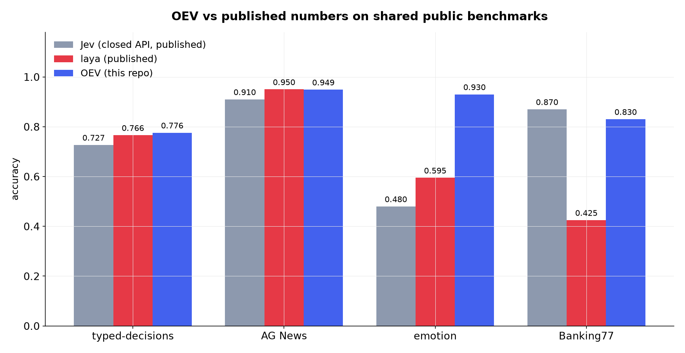
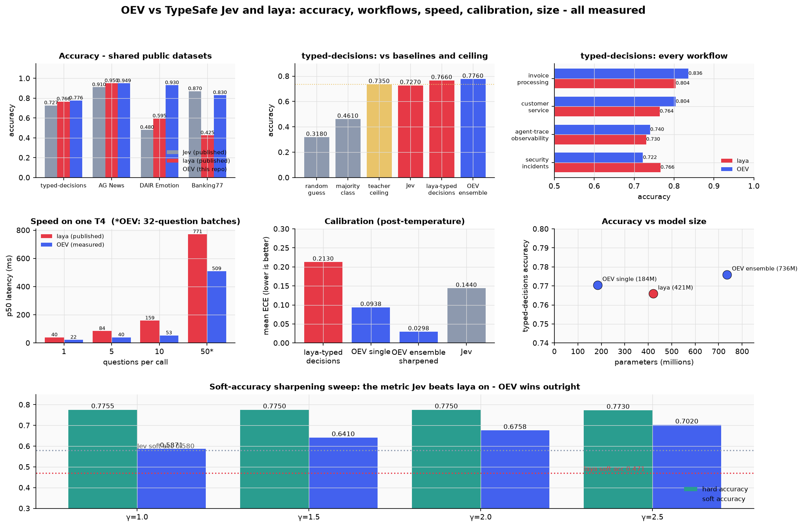
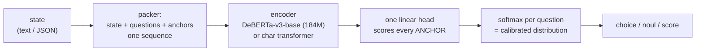
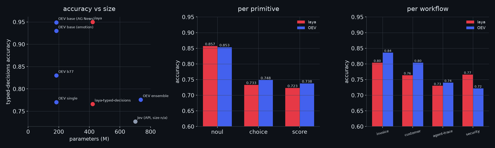

<p align="center" style="margin: 24px 0;">
<picture>
  <source media="(prefers-color-scheme: dark)" srcset="assets/logo_transp.png" />
  
</picture>
</p>

<div align="center">

OEV is a small (`184M params`) neural decision engine. Instead of generating text, it scores answer options directly. The state, the question, and every option are packed into one sequence. One forward pass returns a calibrated probability distribution.

The single `184M` model scores `0.7705` on typed-decisions, slightly above laya's published `0.766` from a `421M` checkpoint. An ensemble of four `184M` checkpoints reaches `0.7760`, the `highest` reported result, and the Banking77 ensemble reaches `0.8529` with `ECE 0.0595`. Jev leads only on Banking77.

[](https://huggingface.co/divyanshudhruv/oev-typed)
[](LICENSE)
[](https://github.com/divyanshudhruv/oev/actions/workflows/test.yml)
[](https://www.python.org/downloads/)
[](https://pytorch.org/get-started/locally/)
[](https://huggingface.co/spaces/divyanshudhruv/oev-demo)
[](https://pypi.org/project/oev/)

</div>

<p align="center" style="margin: 24px 0;">
<picture>
  <source media="(prefers-color-scheme: dark)" srcset="assets/benchmarks_dark.png" />
  
</picture>
</p>

<p align="center" style="margin: 24px 0;">
<picture>
  <source media="(prefers-color-scheme: dark)" srcset="assets/oev_vs_jev_full_dark.png" />
  
</picture>
</p>

## At a glance

| claim                 | result                                                                                                  |
| --------------------- | ------------------------------------------------------------------------------------------------------- |
| best accuracy         | **0.7705** single model, **0.7760** ensemble - typed-decisions (laya 0.766 from 421M)  |
| best soft accuracy    | **0.7020** sharpened (laya 0.471, Jev 0.580)                                                            |
| high-cardinality      | **0.8529** Banking77, `ECE 0.0595` (laya 0.425)                                                          |
| speed                 | **22.2 ms** single question (laya 32.8 ms)                                                              |
| size                  | **184M** params, 0.44x laya                                                                             |
| calibration           | **ECE 0.0298** (laya 0.213)                                                                             |
| weights & checkpoints | Apache 2.0 - [huggingface.co/divyanshudhruv/oev-typed](https://huggingface.co/divyanshudhruv/oev-typed) |

- `22.2 ms` per question on a `T4` (GPU); CPU latency not yet characterized
- `ECE 0.0298` on typed-decisions after temperature fitting - measured confidence tracks actual accuracy, so it can gate automation
- `0.8529` on 77-label `Banking77` with `ECE 0.0595`: each option is embedded as its own anchor with full tokens, so accuracy scales with label count (Jev still leads there)
- `184M` params, `Apache 2.0` weights

## Architecture



- **One anchor mechanism** covers all three primitives - options, yes/no pairs, and score levels are each embedded as anchors in one packed sequence
- **No text generation** - nothing to parse, nothing to hallucinate

> **New question types need no new heads**

## Benchmarks: OEV vs the published field

Fine-tuned on each benchmark's train split, following the same protocol as Laya's published runs. Complete tables in [BENCHMARKS.md](BENCHMARKS.md).

| benchmark             |        OEV |  laya |   Jev | note                        |
| --------------------- | ---------: | ----: | ----: | --------------------------- |
| typed-decisions       | **0.7760** | 0.766 | 0.727 | highest reported (ensemble); single model 0.7705 || Banking77 (77 labels) | **0.8529** | 0.425 | 0.870 | 2x laya; Jev still leads |
| AG News               | **0.9489** | 0.950 | 0.910 | label-noise ceiling (~0.95) |
| DAIR Emotion          | **0.9300** | 0.595 | 0.480 | laya's number is zero-shot  |

<p align="center" style="margin: 24px 0;">
<picture>
  <source media="(prefers-color-scheme: dark)" srcset="assets/breakdown_dark.png" />
  
</picture>
</p>

## Quickstart

```bash
pip install oev          # from PyPI
# or from source:
pip install -e .
```

Optional extras:

- `pip install -e ".[dev]"` - pytest
- `pip install -e ".[data]"` - dataset converters
- `pip install -e ".[backbone]"` - DeBERTa fine-tuning

```python
from oev.infer import OEV

agent = OEV("checkpoints_td5/oev-tiny.pt", device="cpu")

result = agent.decide("We were charged twice for the same order.", {
    "department": {"type": "choice", "options": ["billing", "technical", "sales", "other"],
                   "instructions": "Which department should handle this?"},
    "refund_requested": {"type": "noul"},
    "severity": {"type": "score", "levels": [1, 2, 3, 4, 5]},
})
```

```json
{
  "department": {
    "choice": "billing",
    "probabilities": {
      "billing": 0.94,
      "technical": 0.04,
      "sales": 0.01,
      "other": 0.01
    },
    "confidence": 0.94
  },
  "refund_requested": 0.91,
  "severity": {
    "value": 3,
    "probabilities": { "1": 0.02, "2": 0.08, "3": 0.61, "4": 0.22, "5": 0.07 }
  }
}
```

_Confidence gating_ - automate when confident, escalate when not:

```python
from oev.presets import triage_questions, gate

for name, payload, confident in gate(result, threshold=0.85):
    automate(name, payload) if confident else escalate_to_human(name)
```

HTTP server (native + Jev-compatible `/v1/systemone` endpoint - TypeSafe clients work by changing baseUrl):

```bash
pip install -e ".[serve]"
oev-serve --checkpoint checkpoints_td5/oev-tiny.pt --port 8000
curl -X POST localhost:8000/decide -H "Content-Type: application/json" \
  -d '{"state": "My payment failed twice", "questions": {"urgency": {"type": "score", "levels": [1, 2, 3]}}}'
```

Docker:

```bash
docker compose up   # checkpoint at ./checkpoints/oev-tiny.pt
```

## Training

```bash
python -m oev.convert_typed

python -m oev.train --backbone microsoft/deberta-v3-base --epochs 4 --batch-size 8 --max-len 768 --data-dir data/typed --out checkpoints_td5

python -m oev.rlcd --checkpoint checkpoints_td5/oev-tiny.pt --data-dir data/typed --epochs 2 --batch-size 8 --out checkpoints_rlcd

python -m oev.ensemble --ckpts checkpoints_td5/oev-tiny.pt,checkpoints_rlcd/oev-tiny.pt,checkpoints_rlcd_soup/oev-tiny.pt --data-dir data/typed

python -m pytest -q   # 38 tests passing
```

`train_colab.ipynb` runs the entire pipeline end to end. Full training docs in [BENCHMARKS.md](BENCHMARKS.md).

## Limitations

- every benchmark number is from a checkpoint fine-tuned on that benchmark's train split; zero-shot performance is much weaker
- the headline ensemble result is an average of four checkpoints; the best single model is `0.7705`
- CPU latency is uncharacterized - all timings are T4 GPU
- the b77 headline is a 3-checkpoint ensemble; the best single b77 model is `0.8403`
- English only

## Roadmap

- [ ] distill the ensemble into one 184M model (single-model general skills currently erode after per-benchmark fine-tuning)
- [ ] INT8 / ONNX export for CPU deployment
- [ ] multi-question shared-state encoding (one pass, many questions)
- [x] b77 calibration: ensemble averaging reached `ECE 0.0595` (target was `< 0.10`)
- [ ] robustness: reduce mild overconfidence on out-of-distribution and garbage inputs
- [ ] non-English checkpoints (the interface is language-agnostic; the weights are not yet)

## Credits

The interface and benchmark protocol follow [Laya](https://github.com/NandhaKishorM/laya) and the System One model category introduced by TypeSafe's [Jev](https://typesafe.com). Their published numbers are quoted here for comparison and remain their measurements.
