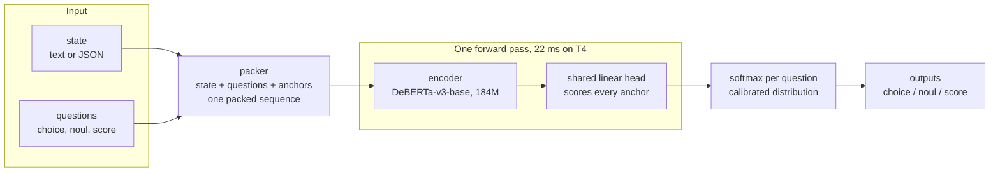

<p align="center" style="margin: 24px 0;">
<picture>
  <source media="(prefers-color-scheme: dark)" srcset="https://raw.githubusercontent.com/divyanshudhruv/oev/main/assets/logo_transp.png" />
  
</picture>
</p>

<div align="center">

OEV is a small (`184M params`) neural decision engine. Instead of generating text, it scores answer options directly. The state, the question, and every option are packed into one sequence. One forward pass returns a calibrated probability distribution.

The single `184M` model scores `0.7705` on typed-decisions, slightly above laya's published `0.766` from a `421M` checkpoint. An ensemble of four `184M` checkpoints reaches `0.7760`, the `highest` reported result, and a single Banking77 soup checkpoint reaches `0.8584` (best ECE `0.0595` from the 3-checkpoint ensemble). Jev leads only on Banking77 (0.870).

[](https://huggingface.co/divyanshudhruv/oev-typed)
[](LICENSE)
[](https://github.com/divyanshudhruv/oev/actions/workflows/tests.yml)
[](https://www.python.org/downloads/)
[](https://pytorch.org/get-started/locally/)
[](https://huggingface.co/spaces/divyanshudhruv/oev-demo)
[](https://pypi.org/project/oev/)

</div>

<p align="center" style="margin: 24px 0;">
<picture>
  <source media="(prefers-color-scheme: dark)" srcset="https://raw.githubusercontent.com/divyanshudhruv/oev/main/assets/benchmarks_dark.png" />
  
</picture>
</p>

<p align="center" style="margin: 24px 0;">
<picture>
  <source media="(prefers-color-scheme: dark)" srcset="https://raw.githubusercontent.com/divyanshudhruv/oev/main/assets/oev_vs_jev_full_dark.png" />
  
</picture>
</p>

<p align="center" style="margin: 24px 0;">
<picture>
  <source media="(prefers-color-scheme: dark)" srcset="https://raw.githubusercontent.com/divyanshudhruv/oev/main/assets/transfer_speed_dark.png" />
  
</picture>
</p>

## At a glance

| claim                 | result                                                                                                  |
| --------------------- | ------------------------------------------------------------------------------------------------------- |
| best accuracy         | **0.7705** single model, **0.7760** ensemble - typed-decisions (laya 0.766 from 421M)                   |
| high-cardinality      | **0.8584** Banking77, one soup checkpoint (`ECE 0.0595` best ensemble; laya 0.425)                      |
| speed                 | **22.2 ms** single question (laya 32.8-39.5 ms published range)                                         |
| size                  | **184M** params, 0.44x laya                                                                             |
| weights & checkpoints | Apache 2.0 - [huggingface.co/divyanshudhruv/oev-typed](https://huggingface.co/divyanshudhruv/oev-typed) |

- `22.2 ms` per question on a `T4` (GPU); on CPU the ONNX INT8 build runs at `54.2 ms` p50 on 8 threads (`228 MB` artifact, 3.2x smaller)
- `0.8584` on 77-label `Banking77` from a single soup checkpoint (the 3-checkpoint ensemble still holds best ECE `0.0595`): each option is embedded as its own anchor with full tokens, so accuracy scales with label count (gap to Jev 1.16 pts)
- `184M` params, `Apache 2.0` weights
- Kev (0.8B / 4B) publishes no in-domain numbers on these datasets, so it is not in the tables; see [BENCHMARKS.md](BENCHMARKS.md) for the like-for-like comparison plan

## Architecture



- **One anchor mechanism** covers all three primitives - options, yes/no pairs, and score levels are each embedded as anchors in one packed sequence
- **No text generation** - nothing to parse, nothing to hallucinate
- **New question types need no new heads** - new options are just new anchors

A from-scratch character-level encoder also exists for the no-transformers path (see `oev/tokenizer.py`); the diagrams and benchmarks here all use the DeBERTa backbone.

## Why not an LLM?

A generative model answers a structured question like this:

> input -> generate text -> parse the output -> validate it -> maybe get a decision

OEV is built for the case where the system already knows the candidate answers:

> state + candidates -> score every candidate -> calibrated probability distribution

If you need open-ended text, use an LLM. If you need many small, bounded decisions - which department, is this refund requested, how severe, escalate or continue - scoring known options directly is cheaper, faster, and structurally immune to output-parsing failures: the outputs are probabilities over the inputs you supplied. Different tool for a different layer of the stack.

## Benchmarks: OEV vs the published field

Fine-tuned on each benchmark's train split, following the same protocol as Laya's published runs. Selected results and evaluation notes are in [BENCHMARKS.md](BENCHMARKS.md).

> [!WARNING]
> Banking77 uses 77 OEV labels, while the published Jev figure is from a 72-label configuration. The `0.8584` and `0.870` values are not a controlled head-to-head comparison.

| benchmark       |                     OEV |  laya |   Jev | note                                                                  |
| --------------- | ----------------------: | ----: | ----: | --------------------------------------------------------------------- |
| typed-decisions |              **0.7760** | 0.766 | 0.727 | highest reported (ensemble); single model 0.7705                      |
| Banking77       |              **0.8584** | 0.425 | 0.870 | 2x laya; gap to Jev 1.16 pts                                          |
| AG News         |              **0.9489** | 0.950 | 0.910 | label-noise ceiling (~0.95)                                           |
| DAIR Emotion    | **0.9300** (fine-tuned) | 0.595 | 0.480 | zero-shot: OEV student **`0.6505`** beats laya's `0.595` head-to-head |

<p align="center" style="margin: 24px 0;">
<picture>
  <source media="(prefers-color-scheme: dark)" srcset="https://raw.githubusercontent.com/divyanshudhruv/oev/main/assets/headline_scorecard_dark.png" />
  
</picture>
</p>

<p align="center" style="margin: 24px 0;">
<picture>
  <source media="(prefers-color-scheme: dark)" srcset="https://raw.githubusercontent.com/divyanshudhruv/oev/main/assets/zeroshot_dark.png" />
  
</picture>
<picture>
  <source media="(prefers-color-scheme: dark)" srcset="https://raw.githubusercontent.com/divyanshudhruv/oev/main/assets/latency_profile_dark.png" />
  
</picture>
</p>

<p align="center" style="margin: 24px 0;">

<picture>
  <source media="(prefers-color-scheme: dark)" srcset="https://raw.githubusercontent.com/divyanshudhruv/oev/main/assets/workflows_dark.png" />
  
</picture><picture>
  <source media="(prefers-color-scheme: dark)" srcset="https://raw.githubusercontent.com/divyanshudhruv/oev/main/assets/decision_primitives_dark.png" />
  
</picture>
</p>

## Quickstart

```bash
pip install oev          # from PyPI
# or from source:
pip install -e .
```

Optional extras:

- `pip install -e ".[dev]"` - pytest
- `pip install -e ".[data]"` - dataset converters
- `pip install -e ".[backbone]"` - DeBERTa fine-tuning
- `pip install -e ".[serve]"` - FastAPI server (`oev-serve`)
- `pip install -e ".[app]"` - Gradio Space dependencies

```python
from oev import OEV

agent = OEV("checkpoints_td5/oev-tiny.pt", device="cpu")

result = agent.decide("We were charged twice for the same order.", {
    "department": {"type": "choice", "options": ["billing", "technical", "sales", "other"],
                   "instructions": "Which department should handle this?"},
    "refund_requested": {"type": "noul"},
    "severity": {"type": "score", "levels": [1, 2, 3, 4, 5]},
})

# Native schema above; the Jev/TypeSafe `criteria` schema (the one laya and Kev
# speak) works unchanged - drop-in for existing Jev clients:
result = agent.decide("We were charged twice for the same order.", {
    "department": {"type": "choice", "instructions": "Which department should handle this?",
                   "criteria": {"billing": "invoices, payments", "technical": "bugs, outages"}},
    "refund_requested": {"type": "noul"},
    "severity": {"type": "score", "criteria": ["minor", "soon", "blocking"]},
})

# The candidate set is an inference-time input - swap it per call, same weights:
state = "play my morning playlist and take a note"
actions = ["open_spotify", "search_web", "open_vscode", "create_note"]
result = agent.decide(state, {"action": {"type": "choice", "options": actions}})
```

```json
{
  "department": {
    "choice": "billing",
    "probabilities": {
      "billing": 0.94,
      "technical": 0.04,
      "sales": 0.01,
      "other": 0.01
    },
    "confidence": 0.94
  },
  "refund_requested": 0.91,
  "severity": {
    "value": 3,
    "probabilities": { "1": 0.02, "2": 0.08, "3": 0.61, "4": 0.22, "5": 0.07 }
  }
}
```

_Confidence gating_ - automate when confident, escalate when not:

```python
from oev.presets import triage_questions, gate

for name, payload, confident in gate(result, threshold=0.85):
    automate(name, payload) if confident else escalate_to_human(name)
```

HTTP server (native + Jev-compatible `/v1/systemone` endpoint - TypeSafe clients work by changing baseUrl):

```bash
pip install -e ".[serve]"
oev-serve --checkpoint checkpoints_td5/oev-tiny.pt --port 8000
curl -X POST localhost:8000/decide -H "Content-Type: application/json" \
  -d '{"state": "My payment failed twice", "questions": {"urgency": {"type": "score", "criteria": ["not urgent", "soon", "blocking"]}}}'
```

Docker:

```bash
docker compose up   # checkpoint at ./checkpoints/oev-tiny.pt
```

## Training

```bash
python -m oev.convert_typed

python -m oev.train --backbone microsoft/deberta-v3-base --epochs 4 --batch-size 8 --max-len 768 --data-dir data/typed --out checkpoints_td5

python -m oev.rlcd --checkpoint checkpoints_td5/oev-tiny.pt --data-dir data/typed --epochs 2 --batch-size 8 --out checkpoints_rlcd

python -m oev.ensemble --ckpts checkpoints_td5/oev-tiny.pt,checkpoints_rlcd/oev-tiny.pt,checkpoints_rlcd_soup/oev-tiny.pt,checkpoints_rlcd_seed1/oev-tiny.pt --data-dir data/typed

python -m pytest -q
```

`train_colab.ipynb` runs the entire pipeline end to end. Evaluation rules and scope notes are in [BENCHMARKS.md](BENCHMARKS.md).

## Reading the numbers

- Each benchmark number comes from a checkpoint fine-tuned on that benchmark's train split, matching the baselines' published protocol
- Zero-shot emotion is a separate head-to-head win: shipped student `0.6505` vs laya `0.595` (both zero-shot)
- The `0.7760` headline is a 4-checkpoint ensemble; the best single file is `0.7705`
- The Banking77 single-file best is the soup at `0.8584`; `0.8403` is a historical re-tune, not the shipped artifact
- Adversarial NLI (ANLI) stays near chance for now; WANLI reaches `0.5645` and an ANLI specialist is next on the roadmap
- The shipped generalist trails the typed specialist (`0.6480` vs `0.7705`); closing that spread is round 4
- CPU: torch fp32 measured `447 ms` p50 at release; on the current workstation the same fp32 model runs `252.5 ms` and the ONNX INT8 build `54.2 ms` (8 threads, `scripts/bench_latency.py`). Headline timings are GPU
- ECE asks: when the model says `0.9`, is it right `90%` of the time. Coverage is the operational read: what share of traffic can be automated at a given error budget (the Banking77 soup covers `76%` at `5%` error). Gate on the distributions, not the confidence field
- English only

## Roadmap

- [ ] Round 3 distillation: 6 teachers, 5 domains including NLI
- [ ] 4-member Banking77 ensemble: the live shot past `0.8584`
- [ ] Round 4: one file near specialist numbers everywhere
- [x] INT8 / ONNX CPU deployment: `54.2 ms` p50 on 8 threads, `228 MB` artifact (`scripts/bench_latency.py`)
- [ ] Multi-question shared-state encoding (one pass, many questions)
- [ ] Robustness: reduce mild overconfidence on out-of-distribution inputs
- [ ] Non-English checkpoints (the interface is language-agnostic; the weights are not yet)

Full list: [ROADMAP.md](ROADMAP.md).

## Documentation

- [Benchmarks](BENCHMARKS.md) - methodology, caveats, reproduction commands, checkpoint hashes
- [Model card](https://huggingface.co/divyanshudhruv/oev-typed) - checkpoints and usage
- [Roadmap](ROADMAP.md) - what is next
- [Contributing](CONTRIBUTING.md) - how to open issues and PRs
- [Changelog](CHANGELOG.md) - release history
- [Security](SECURITY.md) - supported versions and private reporting
- [Hugging Face demo](https://huggingface.co/spaces/divyanshudhruv/oev-demo) - try it in the browser
- [PyPI](https://pypi.org/project/oev/) - `pip install oev`
- Server API - `oev-serve --help`, schema docs in `oev/serve.py`

## Credits

The interface and benchmark protocol follow [Laya](https://github.com/NandhaKishorM/laya), [Kev](https://github.com/jaredpalmer/kev) and the System One model category introduced by TypeSafe's [Jev](https://typesafe.com). Their published numbers are quoted here for comparison and remain their measurements.

---

<p align="center">
  
</p>